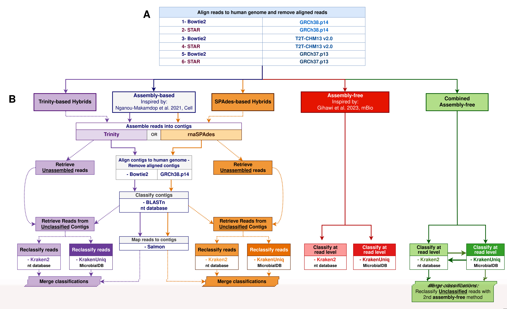

# Extracting microbial signal from host-dominated  metatranscriptomes

Antonin COLAJANNI <sup>1,2</sup>, Raluca URICARU<sup>2</sup>, Rodolphe THIÉBAUT<sup>1</sup>, and Patricia THEBAULT<sup>2</sup> 

<sup>1</sup> Univ. Bordeaux, INSERM, INRIA, BPH, U1219, F-33000 Bordeaux, France 

<sup>2</sup> Univ. Bordeaux, CNRS, Bordeaux INP, LaBRI, UMR 5800, F-33400 Talence, France

Corresponding Author: antonin.colajanni@u-bordeaux.fr 

**Keywords**

Metatranscriptomic, Metagenomics, Host-dominated metatranscriptomes, Microbial translocation


**Abstract** 

Human RNA-seq data originally generated for human transcriptome profiling are overwhelmingly dominated by host sequences, yet they often contain a small fraction of non-human reads that can be exploited for microbial detection. When such datasets are repurposed for secondary microbiome-oriented analyses, extracting and accurately classifying this weak microbial signal becomes technically challenging and no ready-to-use pipeline currently exists. 
In this study  we evaluate computational strategies for filtering host reads and classifying microbial transcripts in host-dominated RNA sequencing data. We compare assembly-based approaches similar to those used in a previous study focusing on microbial translocation, with state-of-the-art  assembly-free methods, and assess their respective strengths and limitations using simulated datasets reflecting low microbial abundance. Our results show that assembly-based methods yield accurate taxonomic predictions but struggle at low read depth, whereas assembly-free methods are  more robust in sparse settings at the cost of reduced precision.
To leverage the complementarity of both approaches, we propose a hybrid pipeline that integrates assembly-based and assembly-free classification. On simulated data, this hybrid strategy improves microbial classification performance compared to either approach alone. Application to a real human metatranscriptomic dataset analysed in a microbial translocation context illustrates the broader microbial signal captured by the hybrid approach, despite intrinsic challenges related  to the absence of reliable ground truth and to the risk of host read misclassification. 
Overall, our work provides a framework for extracting microbial signal from host-dominated human metatranscriptomes, enabling the reuse of existing transcriptomic datasets for microbiome-related analyses, including but not limited to microbial translocation studies.




## Github repository description

MetatranscriptomicsBenchmark/
│
├── pipeline_scripts/
├── figure_scripts/
├── data/
├── database_clean/
└── README.md

The directory `./pipeline_scripts/` contains the scripts necessary to run the pipelines described in our analysis.

The directory `./figure_scripts/` contains the ressources that were used for the real data analysis: the SRR ids of the samples and the corresponding metadata

The directory `./data/` contains the scripts that were used to produce the figures.

The directory `./database_clean/` contains the taxids of the selected taxa used in the simulated part of the analysis.


## Pipeline Scripts

The `pipeline_scripts` directory contains the scripts used to reproduce the benchmarking workflow described in this study. These scripts implement the full processing pipeline starting from raw sequencing data to taxonomic classification and hybrid dataset generation.

The pipeline is organized into several logical steps corresponding to the different stages of metatranscriptomic data processing.

---

### Retrieval of sequencing data

Scripts in this step download the raw sequencing datasets used in the benchmark.  
These scripts retrieve FASTQ files directly from public repositories.

Output of this step:
- Raw paired-end FASTQ files

These files serve as the input for the downstream preprocessing and classification workflows.

```bash
sbatch ./pipeline_scripts/01-get_SRA_file.sh
```

---

### 2. QC and host reads removal

Before microbial analysis, Quality Check and an initial human-read filtration is done.

In this step, sequencing reads are aligned to the human reference genome and reads mapping to the host are filtered out. This preprocessing stage ensures that downstream analyses focus exclusively on non-host (microbial) sequences.

Typical workflow:

```
Raw FASTQ → QC → 6 alignments to human genome (BOWTIE2 and STAR on hg38, CHM13 and hg19) → filtered FASTQ
```

Output of this step:
- Host-filtered FASTQ files

These filtered reads are used for both assembly-based and assembly-free analyses.


```bash
sbatch ./pipeline_scripts/02-trim_reads.sh
sbatch ./pipeline_scripts/03-Alignment_array.sh
```

---

### 3. Taxonomic classification strategies

The repository implements two different classification approaches that are compared in the benchmark.

#### Assembly-free classification

In the read-based strategy, filtered reads are directly classified taxonomically using a Kraken-based approach: (Kraken2 / KrakenUniq)

Workflow:

```
Filtered reads → Kraken classification → taxonomic profiles
```


```bash
# For KrakenUniq
sbatch ./pipeline_scripts/04alt-Kraken_classif.sh ~/data/STAR_mapping_hg19/ ~/results/ PE kuniq $microbialDB ~/data/sra_list_RNA.txt

# For Kraken2
sbatch ./pipeline_scripts/04alt-Kraken_classif.sh ~/data/STAR_mapping_hg19/ ~/results/ PE kraken2 $k2_nt ~/data/sra_list_RNA.txt
```

Output of this step:
- CLassification at read level in `~/results/kraken/microbialDB/kuniq/sampleID/ReadsClassif.txt` or `~/results/kraken/nt/kraken2/sampleID/ReadsClassif.txt`


---

#### Assembly-based classification

In the assembly-based strategy, filtered reads are first assembled into conts before taxonomic annotation

Assemblers used in the pipeline include:

- Trinity
- (rna)SPAdes

Typical workflow:

```
Filtered reads
      ↓
Contigs assembly (Trinity or SPAdes)
      ↓
Retrieving unmapped contigs against hg38 
      ↓
Classify contigs(BLASTn)
      ↓
Read level classification by mapping reads to contigs (Salmon)
```

This strategy allows read-level classification based on assembled sequences


##### 1) Assemble reads

```bash
# For Trinity
sbatch ./pipeline_scripts/04alt-Trinity_parallel.sh ~/data/ ~/results/ PE ~/data/sra_list_RNA.txt ~/data/STAR_mapping_hg19/

# For SPAdes
sbatch ./pipeline_scripts/04-Spades_assembly.sh ~/results/ PE ~/data/sra_list_RNA.txt ~/data/STAR_mapping_hg19/
```

##### 2) Map contigs against hg38, retrieve unmapped contigs 

```bash

# For Trinity
sbatch ~/pipeline_scripts/Alignment/04-Bowtie_align.sh ~/results/Contigs/ trinity ~/data/sra_list_RNA.txt hg38 ~/results/Contigs/ TRUE FALSE FALSE  

# For SPAdes
sbatch ~/pipeline_scripts/Alignment/04-Bowtie_align.sh ~/results/Contigs_rnaSpades/ trinity ~/data/sra_list_RNA.txt hg38 ~/results/Contigs_rnaSpades/ TRUE FALSE FALSE  

```

##### 3) Classify Contigs

```bash
# For Trinity
sbatch ./pipeline_scripts/05-BLAST_request.sh ~/results/Contigs/ ~/data/sra_list_RNA.txt TRUE FALSE trinity

# For SPAdes
sbatch ./pipeline_scripts/05-BLAST_request.sh ~/results/Contigs_rnaSpades/ ~/data/sra_list_RNA.txt TRUE FALSE rnaSpades
```

##### 4) Retrieve Reads classif from contig annotation

```bash
# For Trinity
sbatch ./pipeline_scripts/06-SalmonQuantification.sh ~/results/Contigs/ ~/data/STAR_mapping_hg19/ PE ~/data/sra_list_RNA.txt FALSE .fastq SRR trinity
#
 For SPAdes
sbatch ./pipeline_scripts/06-SalmonQuantification.sh ~/results/Contigs/ ~/data/STAR_mapping_hg19/ PE ~/data/sra_list_RNA.txt FALSE .fastq SRR rnaSpades
```

Output of this step:
- CLassification at read level in `~/results/Contigs/sampleID/ContigsToReads/ReadsClassif.txt` or `~/results/Contigs_rnaSpades/sampleID/ContigsToReads/ReadsClassif.txt`


### Hybrid results generation

Additional scripts generate hybrid strategies results for by combining the output from each strategies:
- Hybrid-Trinity-KUniq
- Hybrid-Trinity-Kraken2
- Hybrid-SPAdes-KUniq
- Hybrid-SPAdes-Kraken2
- KUniq-K2
- K2-KUniq

  
```bash
RESULTS_PATH=~/results/

if    [ $CLASSIF_1 = "kuniq" ] ; then 
      classif_path1=${RESULTS_PATH}/kraken/microbialDB/kuniq/
      name1="kuniq"

elif  [ $CLASSIF_1 = "kraken2" ] ; then 
      classif_path1=${RESULTS_PATH}/kraken/nt/k2uniq/     
      name1="kraken2"

elif  [ $CLASSIF_1 = "Blast" ] ; then 
      classif_path1=${RESULTS_PATH}/Contigs/ 
      name1="Blast"

elif  [ $CLASSIF_1 = "spadesBlast" ] ; then 
      classif_path1=${RESULTS_PATH}/Contigs_rnaSpades/
      name1=spadesBlast
fi

if    [ $CLASSIF_2 = "kuniq" ] ; then 
      classif_path2=${RESULTS_PATH}/kraken/microbialDB/kuniq/
      name2="kuniq"

elif  [ $CLASSIF_2 = "kraken2" ] ; then 
      classif_path2=${RESULTS_PATH}/kraken/nt/kraken2/     
      name2="kraken2"
fi


method_name=hybrid_${name1}-${name2}


sbatch ./pipeline_scripts/07-Hybrid_classif.sh $RESULTS_PATH $classif_path1 $classif_path2 ~/data/sra_list_RNA.txt $method_name

```

Output of this step:
- CLassification at read level for each strategies in  `~/results/hybrid/${method_name}/sampleID/ReadsClassif.txt` 


